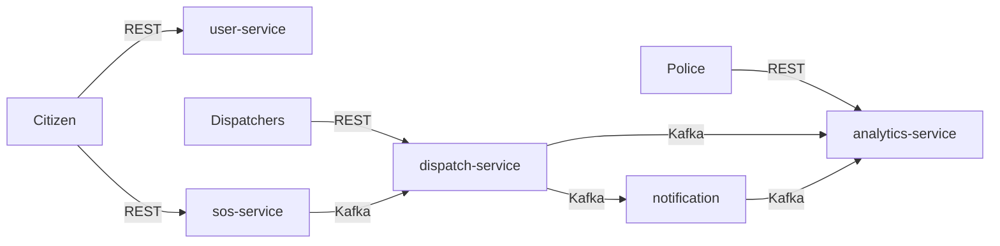
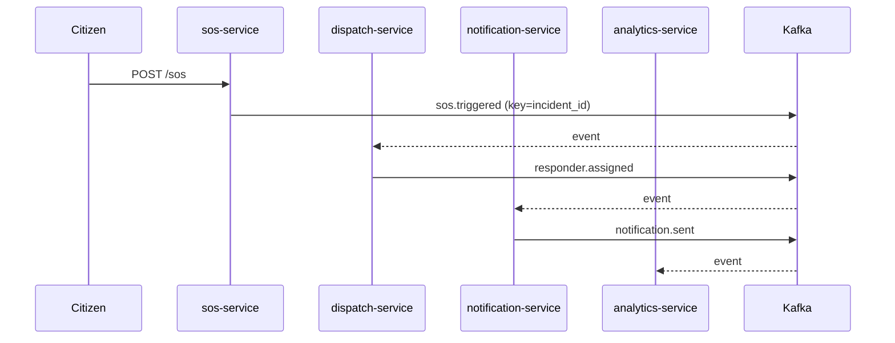
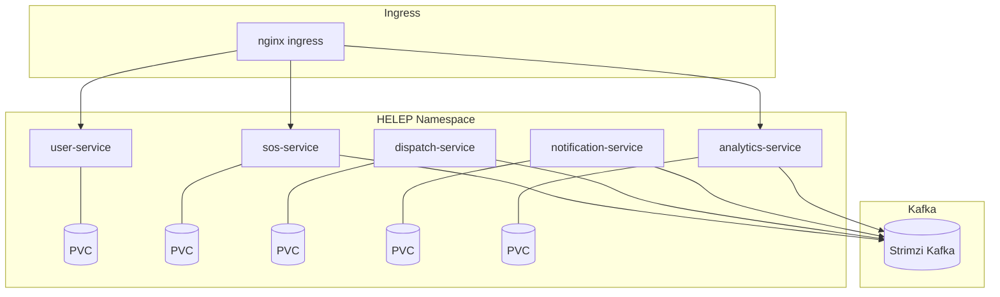

# L4 Design Process Document — HELEP

> Fill every section. Keep total length ~5 pages. Marks rest on **traceability**: every architectural choice must trace back to a requirement, driver, or constraint from the SRS.

---

## 1. Project Specification

HELEP is an emergency response platform that lets citizens trigger SOS incidents with their location and contact details, then routes those incidents to responders and notifies stakeholders. Primary users are **citizens** (who trigger and cancel SOS), **responders** (who receive assignments and confirm they are en‑route), **police/dispatch analysts** (who view incident statistics and zone heatmaps), and **administrators** (who manage availability and system configuration). The business value is reduced response time, better coordination, and increased public safety through reliable dispatch and notification, even when users are offline. The architecture must be fast, resilient, and secure, while remaining lightweight enough to be delivered in a 24‑hour implementation window.

## 2. Requirements Analysis

### 2.1 Functional requirements (from SRS §2)

| # | Requirement | Source line (SRS §2) |
|---|-------------|----------------------|
| F1 | Users can sign up and log in with phone/password and receive a JWT. | SRS §2 |
| F2 | Citizens can manage emergency contacts linked to their profile. | SRS §2 |
| F3 | Citizens can trigger an SOS with location and mode (online/offline). | SRS §2 |
| F4 | Citizens can cancel an active SOS and query its status. | SRS §2 |
| F5 | The system assigns one responder to an incident and prevents double-dispatch. | SRS §2 |
| F6 | The system delivers notifications for assignments and safety alerts, including offline SMS fallback. | SRS §2 |
| F7 | Police users can view analytics endpoints for incidents and zone statistics. | SRS §2 |
| F8 | Each service exposes health, readiness, and metrics endpoints for ops. | SRS §2 |

### 2.2 Non-functional requirements

For each NFR in SRS §3, one measurable acceptance criterion:

- **Availability:** 99.5% monthly uptime for `/healthz` and `/readyz` across services in the HELEP namespace.
- **Usability:** 95% of SOS triggers return HTTP 201 within 1 second at 100 req/s.
- **Confidentiality:** All protected endpoints require valid JWT; rejected requests return 401 with no sensitive data.
- **Integrity:** No incident receives more than one active responder assignment; enforced by atomic DB update and PK constraints.
- **Reliability:** At-least-once delivery for Kafka events; handlers reprocess after failure without data corruption.
- **Scalability:** Services scale from 1 to 3 replicas with CPU >70% while maintaining sub-second publish latency.
- **Compatibility:** System runs on Kubernetes with Helm and Kafka (Strimzi), and images use Python 3.12.

These criteria are intentionally measurable so they can be validated with load tests (e.g., `hey`/`k6`), simple synthetic probes, and Prometheus queries. For example, the latency requirement can be sampled by timing the `POST /sos` response and the downstream `notification.sent` counter increase. The reliability requirement is verified by reprocessing the same Kafka event and observing idempotent behavior (no duplicate assignments or notifications). Security is validated by attempting protected endpoints with invalid JWTs and confirming no sensitive data leakage.

### 2.3 Constraints (SRS §4)

- **Single response at any moment**: a responder cannot be assigned to multiple incidents concurrently. **Risk:** race conditions and double-dispatch under load. **Mitigation:** DB-level atomic update and assignment PK in `dispatch-service`.
- **Trigger → notify < 1 second**: incident trigger must propagate quickly to notifications. **Risk:** synchronous chains increase latency. **Mitigation:** event-driven choreography and Kafka partition keying by `incident_id`.
- **Offline mode supported**: offline SOS must still generate a notification to the victim. **Risk:** branching logic could be inconsistent. **Mitigation:** explicit offline check in notification handler.
- **Kubernetes packaging required**: all services must run in K8s with persistent storage. **Risk:** SQLite loss on restart. **Mitigation:** PVC-mounted `/data` per service.

## 3. Architectural Drivers & ASRs (Lecture 1 material)

### ASR 1 — Reliability (no double dispatch)
**Quality attribute:** Reliability & Integrity  
**Scenario:** When multiple SOS events are processed concurrently, only one responder is assigned per incident and each responder is busy with at most one incident.  
**Measure:** zero duplicate assignments under 100 concurrent triggers.  
**Justification:** This is a core safety constraint and failure directly harms users.

### ASR 2 — Availability & low latency
**Quality attribute:** Availability & Performance  
**Scenario:** From SOS trigger to notification, the system must stay under 1 second in normal load.  
**Measure:** P95 end-to-end time < 1s in local cluster.  
**Justification:** Late notifications reduce public safety; speed is a primary user expectation.

### ASR 3 — Confidentiality
**Quality attribute:** Security  
**Scenario:** Only authenticated users can trigger or cancel SOS, or view their profile.  
**Measure:** 100% of protected endpoints enforce JWT and reject invalid tokens.  
**Justification:** Emergency systems handle sensitive data; leakage is unacceptable.

Together, these three ASRs guide the architecture more than any individual functional requirement. Reliability demands idempotent data access and partitioned event streams; low latency pushes asynchronous workflows and minimal cross-service blocking; confidentiality influences API boundaries, secrets management, and network policy. When trade‑offs occur (for example, using SQLite for speed of implementation), the decision is assessed against these drivers first.

## 4. Component Identification (Lecture 4 step)

### 4.1 SRS-listed components

User Management, Emergency Component, Incident Report & Response, Localization, Alert Management, Alert Delivery, Feedback & Review (out of scope), and Analytics & Statistics.

### 4.2 Your service decomposition

We deliver five services by merging or splitting SRS components to fit the 24‑hour scope:

| Service | Collapsed components | Justification |
|---|---|---|
| `user-service` | User Management | Isolates identity, JWT, and contacts; clean ownership of credentials. |
| `sos-service` | Emergency Component + Incident Report (trigger) | Keeps SOS creation atomic with incident persistence; minimizes latency. |
| `dispatch-service` | Incident Response + Localization + Alert Mgmt (decision) | Centralizes matching, assignment, and safety zone checks. |
| `notification-service` | Alert Delivery | Keeps delivery side-effects separate and replaceable (SMS gateway out of scope). |
| `analytics-service` | Analytics & Statistics | Read-only model optimized for police dashboards. |

This decomposition preserves clear ownership boundaries and mirrors the event flow in the SRS: incident creation, responder decision, notification delivery, and aggregate analysis. Splitting notification delivery allows future integration with real SMS providers without disrupting dispatch logic. Keeping analytics isolated avoids cross-cutting read queries on operational tables and simplifies scaling for read-heavy police queries.



## 5. Architectural Style — Choice & Justification (Lecture 2)

The prescribed style is **microservices + event-driven choreography**. Microservices allow each bounded context (identity, SOS capture, dispatch, notifications, analytics) to evolve independently and scale based on its own load. Event-driven Kafka flows minimize synchronous coupling and allow the saga to advance even when a downstream service is briefly unavailable.

This style also improves fault isolation: if `notification-service` degrades, it does not block SOS creation or dispatch. Event logs provide durable integration points and make the system more observable. The main downside is operational complexity (Kafka, multiple deployables, and distributed debugging), which is acceptable because the SRS prioritizes availability and reliability over minimal infrastructure.

**Alternative 1: Monolith (layered).**  
Could satisfy basic functionality, but struggles with ASR‑1 (reliability under concurrency) and ASR‑2 (latency) because long call chains and shared DB contention increase failure blast radius. The dominant trade‑off is simpler deployment versus poor fault isolation.

**Alternative 2: Serverless functions.**  
Event-driven fits, but cold starts and per‑invocation latency threaten the <1s requirement. It also complicates local development and limits long‑running Kafka consumers. The trade‑off is reduced ops burden at the cost of predictability and performance.

The microservices + Kafka choice directly supports Availability, Reliability, and Scalability NFRs while preserving clear ownership boundaries.



## 6. Architectural Patterns Applied (Lecture 3 material)

Minimum: the 6 implemented in the starter (Saga, Pub/Sub, Repository, Strategy, Outbox-lite, Circuit-Breaker) + 2 of your own.

| Pattern | Where (file:line) | Problem it solves |
|---|---|---|
| Choreographed Saga | `services/sos-service/app/main.py:78-110`, `services/dispatch-service/app/main.py:62-103`, `services/notification-service/app/main.py:52-71` | Coordinates multi-step incident handling without a central orchestrator. |
| Pub/Sub (Kafka) | `services/sos-service/app/events.py:105-139` | Decouples services and provides at-least-once delivery. |
| Repository | `services/user-service/app/db.py:1-69` | Keeps data access consistent and testable. |
| Strategy | `services/dispatch-service/app/matching.py:31-79` | Swaps responder selection algorithm via env var. |
| Outbox-lite | `services/sos-service/app/main.py:83-96` | Ensures DB write and event publish are adjacent in code path. |
| Circuit Breaker | `services/sos-service/app/events.py:58-99` | Prevents repeated Kafka publish attempts during broker outages. |
| API Gateway | `charts/helep/templates/ingress.yaml:1-30` | Unified ingress routing for external clients. |
| Autoscaling (HPA) | `charts/helep/charts/user-service/templates/hpa.yaml:1-18` | Elastic scaling under variable load. |

> Detailed explanations and additional commentary are provided in `patterns-template.md`.

## 7. Architecture Decision Records (ADRs)

```
# ADR-001: Kafka partitioning by incident_id (3 partitions)
## Context
Events for a single SOS must preserve order and avoid double-dispatch.
## Decision
Use Kafka with 3 partitions and key all saga events by incident_id.
## Consequences
Ordering per incident is preserved and consumers scale horizontally; keys skew can create hot partitions.
## Alternatives Considered
Single partition (simple but no parallelism), random keying (parallelism but no ordering).
```

```
# ADR-002: SQLite per service + PVC
## Context
We need fast local dev and persistent state across pod restarts.
## Decision
Each service uses its own SQLite DB mounted at /data via PVC.
## Consequences
Simple persistence and isolation; limited concurrency and no cross-service joins.
## Alternatives Considered
Shared Postgres (stronger consistency but higher ops and tighter coupling).
```

```
# ADR-003: Helm umbrella chart
## Context
Five services share the same release lifecycle and config patterns.
## Decision
Use an umbrella chart with subcharts for each service.
## Consequences
One install/upgrade command; slightly more complex values structure.
## Alternatives Considered
Separate charts per service (more flexible but harder to deploy consistently).
```

## 8. Trade-offs & Improvement Perspectives

1. **SQLite is not horizontally scalable.** Under high concurrency, SQLite can become a bottleneck and limits multi‑writer throughput. **Improvement:** migrate to Postgres with per‑service schemas and connection pooling.
2. **Kafka single-broker setup in dev.** The Strimzi spec uses a single replica for speed, which is not HA. **Improvement:** move to 3‑broker cluster with replication factor 3 and rack awareness.
3. **Limited observability (no tracing).** Metrics exist, but distributed tracing is absent, which makes latency debugging harder. **Improvement:** add OpenTelemetry tracing and propagate trace IDs via Kafka headers.

Additional enhancement ideas include: (a) introducing a dead-letter topic and retry policy for failed events to avoid noisy loops, (b) implementing structured domain events with explicit schemas (e.g., AsyncAPI or JSON Schema) to reduce integration drift, and (c) adding rate-limiting at the ingress gateway to protect against abusive clients during peak incidents.



## 9. Submission checklist

- [x] Every section above completed
- [x] At least 3 diagrams (mermaid)
- [x] Every choice traced to an SRS line, an NFR, or an ASR
- [x] 3 ADRs included
- [x] Word count ~2000–3000
